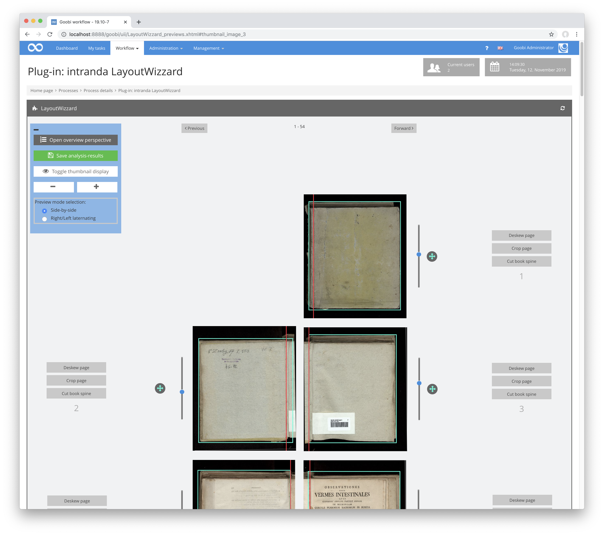
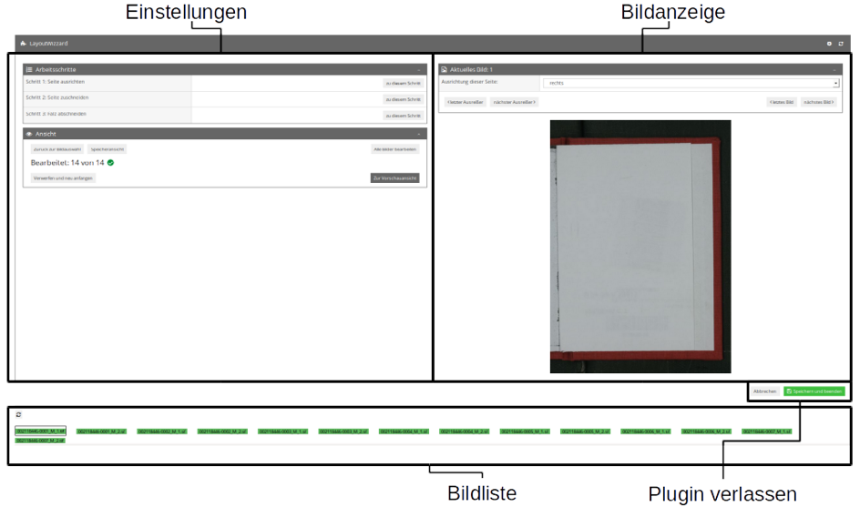
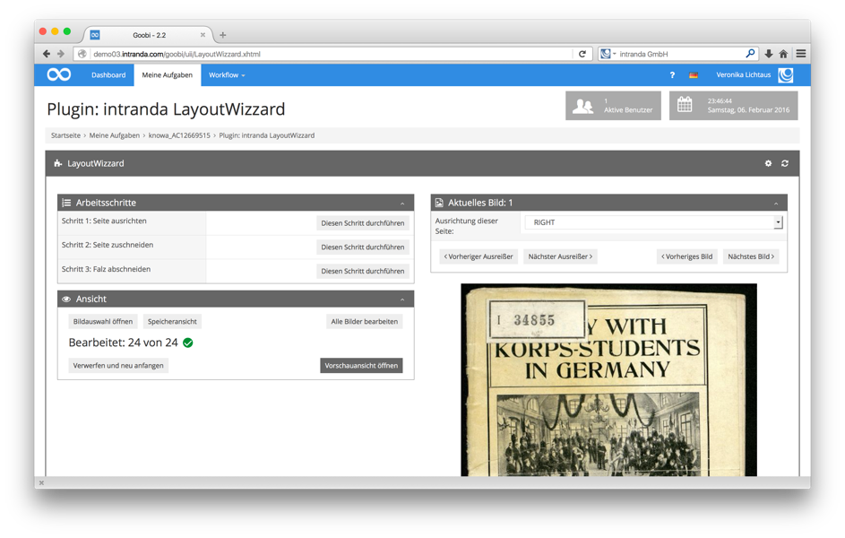
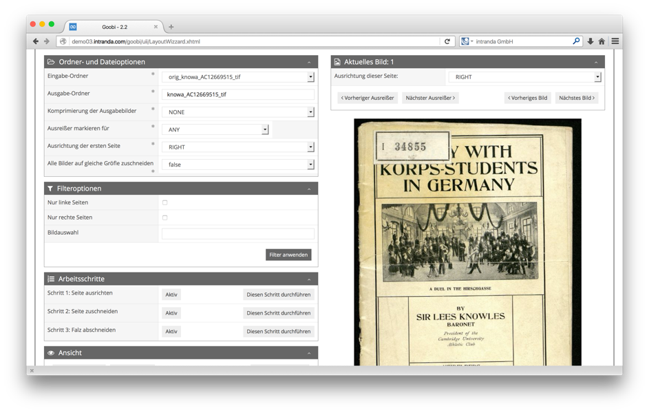
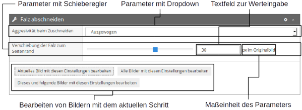
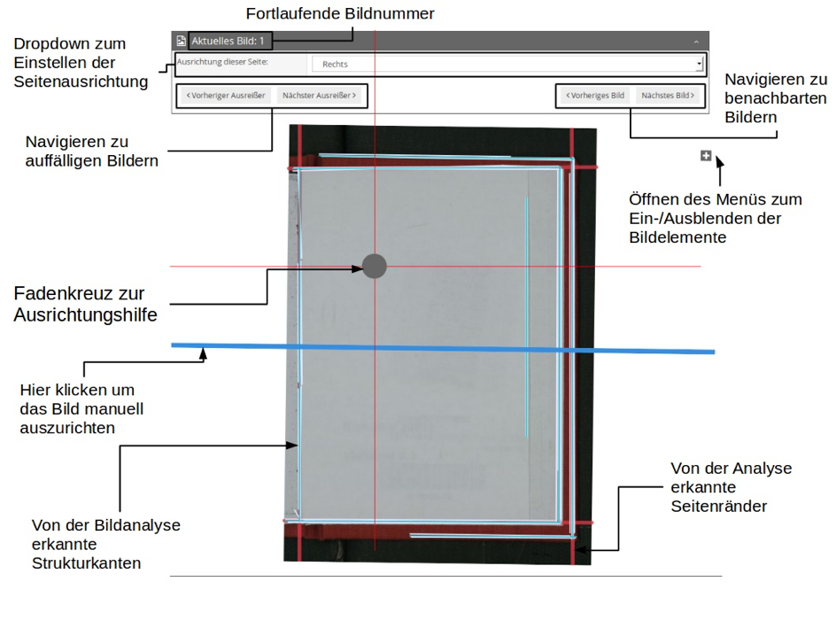
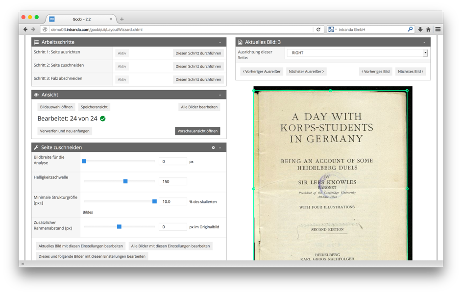
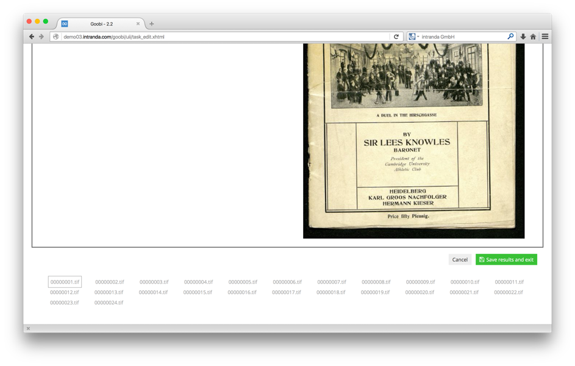
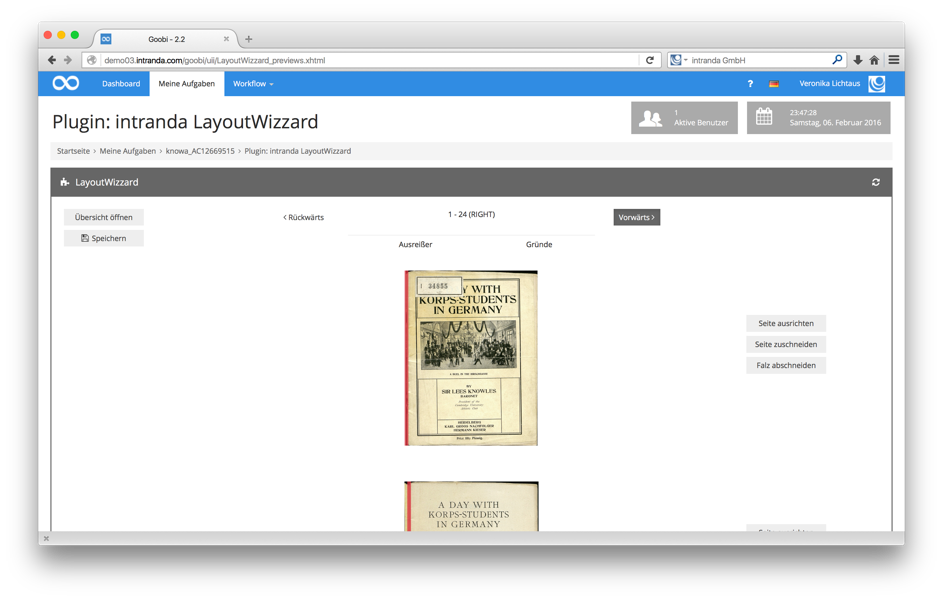
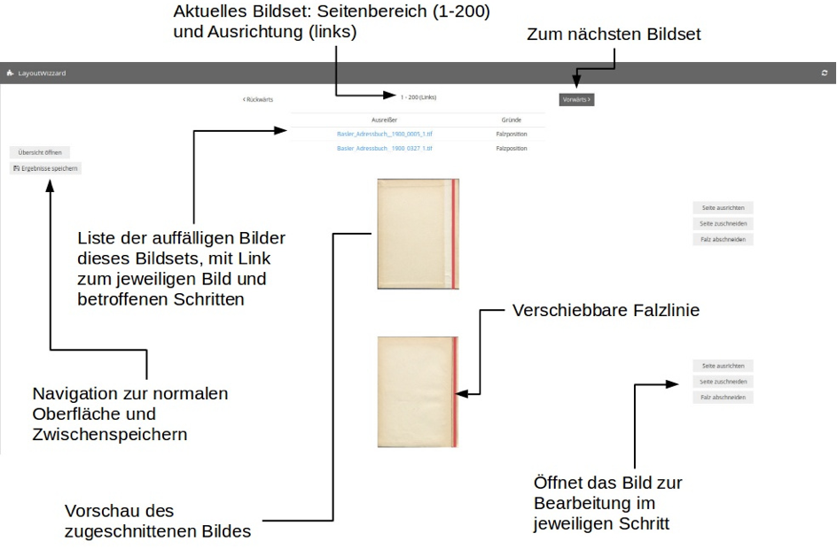

# LayoutWizzard

## 1. Einführung

Der LayoutWizzard ist ein Werkzeug zur Analyse vom digitalisierten Buchseiten und ähnlicher Materialien, das die Position der physischen Seite im digitalisierten Bild erkennt und das Bild danach ausrichten und schneiden kann.

| Details |  |
| :--- | :--- |
| Version des Plugins | 1.0.0 |
| Identifier | intranda\_step\_crop |
| Source code | - noch nicht öffentlich verfügbar - |
| Kompatibilität | Goobi workflow 3.0 |
| Dokumentation vom | 07.02.2016 |

## 2. Installation

Die Installation besteht aus insgesamt vier Programmbibliotheken, die im Apache Tomcat bzw. in Goobi erreichbar sein müssen:

| Datei | Speicherort |
| :--- | :--- |
| `opencv.jar` | Im Tomcat lib-Ordner |
| `layoutwizzard.jar` | Im lib-Ordner der Goobi webapp im Tomcat |
| `plugin_intranda_step_LayoutWizzard.jar` | Im Ordner plugins/step im Goobi-Arbeitsverzeichnis |
| `plugin_intranda_step_LayoutWizzard-GUI.jar` | Im Ordner plugins/GUI im Goobi-Arbeitsverzeichnis |

Zusätzlich werden zwei Konfigurationsdateien benötigt, eine für das Goobi-Plugin, und eine für die zugrundeliegende LayoutWizzard-Bibliothek.

Die Konfigurationsdatei des Plugins `plugin_LayoutWizzardPlugin.xml` muss im Konfigurationsverzeichnis config innerhalb des Goobi-Arbeitsverzeichnisses liegen. Üblicherweise ist dies entsprechend dieser Pfad zur Datei:

```text
/opt/digiverso/goobi/config/plugin_LayoutWizzardPlugin.xml
```

Innerhalb dieser Datei wird der Pfad zur eigentlichen Konfigurationsdatei des LayoutWizzards angegeben. Der Aufbau dieser Datei sieht dabei folgendermaßen aus:



```markup
<config_plugin>
        <layout-wizzard-config-path>
                /opt/digiverso/intranda/LayoutWizzard/layoutwizzard_config.xml
        </layout-wizzard-config-path>
</config_plugin>
```



Die eigentliche Konfigurationsdatei gibt für den Vorgang der Layouterkennung verschiedene Parameter vor. Diese Parameter sind beispielhaft in der folgenden Konfigurationsdatei aufgeführt. Diese befindet sich, wie in der Plugin-Konfigurationsdatei definiert unter folgendem Pfad:

```text
/opt/digiverso/intranda/LayoutWizzard/layoutwizzard_config.xml
```

Beispielhaft hat diese Konfigurationsdatei den folgenden Inhalt:



```markup
<!-- intranda Layout Wizzard configuration file -->
<config>
    <contentServerUrl>http://demo03.intranda.com/goobi/cs/cs</contentServerUrl>
    <defaultOutputFolderSuffix>media</defaultOutputFolderSuffix>
    <analysisImagesBasePath>/home/florian/LayoutWizzard/samples/</analysisImagesBasePath>
    <previews>
        <previewsPerPage>100</previewsPerPage>
        <maxPreviewsCached>10000</maxPreviewsCached>
        <previewWidth>700</previewWidth>
        <imageHeightLarge>800</imageHeightLarge>
    </previews>
    <outliers>
        <errorMultiplier>3.0</errorMultiplier>
        <weightExponent>2.0</weightExponent>
    </outliers>
    <saving>
        <defaultCompression quality="85">NONE</defaultCompression>
        <overwriteExistingImages>true</overwriteExistingImages>
    </saving>
    <analysis id="firstPageLeft">
        <firstPageOrientation>LEFT</firstPageOrientation>
    </analysis>
    <analysis id="firstPageRight">
        <firstPageOrientation>RIGHT</firstPageOrientation>
    </analysis>
    <analysis>
        <analysisStep name="PAGESKEW" type="edges" use="true">
            <saveAnalysisImages visibility="INVISIBLE" path="DESKEW">false</saveAnalysisImages>
            <deskewerMode visibility="VISIBLE">ALL_EDGES</deskewerMode>
            <lineFinderMode>CONTOURS</lineFinderMode>
            <lineGroupingMode>GROUP_BY_DISTANCE</lineGroupingMode>
            <featureSizeThreshold>10.0</featureSizeThreshold>
            <analysisImageSize>300</analysisImageSize>
            <lowerCannyThreshold>70</lowerCannyThreshold>
            <cannyRatio>2</cannyRatio>
            <distanceResolution>1</distanceResolution>
            <angleResolution>1</angleResolution>
            <minHoughLineLength>10</minHoughLineLength>
            <houghLineThreshold>50</houghLineThreshold>
            <maxHoughLineGapSize>2</maxHoughLineGapSize>
            <maxLineAngleDeviation>5</maxLineAngleDeviation>
            <maxLineDistance>7</maxLineDistance>
            <rimAreaToIgnoreLines>0.0</rimAreaToIgnoreLines>
        </analysisStep>
        <analysisStep name="CONTENTAREA" use="true">
            <analysisImageSize>0</analysisImageSize>
            <saveAnalysisImages visibility="INVISIBLE" path="edgeDetection">false</saveAnalysisImages>
            <bitonalThreshold>150</bitonalThreshold>
            <bitonalInvert>false</bitonalInvert>
            <featureSizeThreshold>10.0</featureSizeThreshold>
            <contentPadding visibility="VISIBLE">0</contentPadding>
        </analysisStep>
        <analysisStep name="BOOKSPINE" use="true">
            <analysisImageSize>400</analysisImageSize>
            <saveAnalysisImages visibility="INVISIBLE" path="spineDetection">false</saveAnalysisImages>
            <lineFinderMode>CONTOURS</lineFinderMode>
            <lineGroupingMode visibility="INVISIBLE">GROUP_BY_DISTANCE</lineGroupingMode>
            <croppingAggressiveness visibility="VISIBLE">BALANCED</croppingAggressiveness>
            <lowerCannyThreshold>40</lowerCannyThreshold>
            <cannyRatio>2</cannyRatio>
            <distanceResolution>1</distanceResolution>
            <angleResolution>1</angleResolution>
            <minHoughLineLength>20</minHoughLineLength>
            <houghLineThreshold>10</houghLineThreshold>
            <maxHoughLineGapSize>4</maxHoughLineGapSize>
            <maxLineAngleDeviation>5</maxLineAngleDeviation>
            <maxLineDistance>5</maxLineDistance>
            <featureSizeThreshold>0.1</featureSizeThreshold>
            <rimAreaToIgnoreLines>0.0125</rimAreaToIgnoreLines>
            <maxGroupAngleDeviation visibility="INVISIBLE">10</maxGroupAngleDeviation>
            <spineOffset visibility="VISIBLE">5</spineOffset>
        </analysisStep>
    </analysis>
</config>
```



## 3. Grundsätzliche Arbeitsweise

Das Goobi-Plugin LayoutWizzard \(im Folgenden kurz als Plugin bezeichnet\) erlaubt die vollständige Analyse von Bildern, sowie das anschließende Abspeichern von bearbeiteten Bildern. Die Bezeichnungen Analyse und Bearbeitung werden dabei synonym verwendet und bezeichnen beide die Bildanalyse der Ausgangsbilder in mehreren Schritten.


Üblicherweise werden im Rahmen der Analyse und Bearbeitung folgende drei Schritte ausgeführt:

**1. Ausrichten:**  
Die Drehung der Buchseite gegenüber den Bildrändern wird ermittelt, um sie im Ausgabebild so rotieren zu können, dass sie möglichst waagerecht ausgerichtet ist.

**2. Zuschneiden:**  
Die Ausmaße der Seite oder der sonstigen Objekte werden ermittelt und ein rechteckiger Rahmen um die Seite oder das Objekt wird berechnet. Im Ausgabebild ist nur der Inhalt dieses Rechtecks enthalten, alle außerhalb liegenden Bildinhalte werden abgeschnitten

**3. Buchfalz bestimmen:**  
Die Position der Buchfalz wird ermittelt. An ihr wird der rechte oder linke Bildrand abgeschnitten. Da zur Bestimmung der Buchfalz die Ausrichtung der rechten oder linken Buchseite entscheidend ist, wird diese Ausrichtung vom Plugin errechnet und kann vom Benutzer angepasst werden. Handelt es sich bei dem zu untersuchenden Material nicht um ein gebundenes Buch, so kann der Schritt der Buchfalzerkennung deaktiviert werden. Die Ausrichtung der Seiten hat dann keine Bedeutung.

Die Analyse aller Bilder wird gestartet, indem man auf Alle Bilder bearbeiten klickt. Die Ergebnisse der Analyse werden zusammen mit der verwendeten Analysekonfiguration in der Datei imageData.xml gespeichert, und zwar immer beim Klick auf Speichern und Beenden unten rechts innerhalb der Plugin-Oberfläche oder indem man auf Ergebnisse speichern in der Vorschauansicht klickt. Diese Datei wird dann beim erneuten Laden des Plugins verwendet, um die bisherigen Analyseergebnisse wiederherzustellen. Die Datei wird gelöscht, wenn man auf Verwerfen und neu anfangen klickt.

Über Speicheransicht öffnen kann man nach Vollenden der Analyse die anhand der Analyseergebnisse rotierten und zugeschnittenen Bilder in den Ausgabeordner speichern.

## 4. Verwendung der Taskmanager-Plugins

Da sowohl die Analyse als auch das Speichern der Bilder bei großen Vorgängen sehr lange dauern können, werden diese automatischen Aufgaben üblicherweise in den intranda Taskmanager ausgelagert, in dem zwei Plugins für diese beiden Aufgaben verfügbar sind.

Anschließend übernimmt das Goobi-Plugin die Analyse-Ergebnisse des Taskmanager-Analyseplugins und zeigt beim Öffnen bereits an, dass alle Bilder bearbeitet wurden. Zur Kontrolle der Ergebnisse kann man direkt in die Vorschauansicht wechseln und von dort aus alle notwendigen Anpassungen der Ergebnisse vornehmen. Ist man mit dieser Überprüfung fertig, verlässt man das Plugin über `Ergebnisse speichern und beenden`, so dass das Taskmanager-Speicherplugin die Ausgabebilder anhand der Ergebnisse erstellen kann. Man kann natürlich auch noch einmal das Goobi-Plugin öffnen, um mit der Kontrolle und Korrektur der Ergebnisse fortzufahren. Erst wenn die Kontrolle vollständig beendet ist, schließt man den Schritt ab, um die Ergebnisse zum Taskmanager-Plugin zum Speichern zu schicken.



## 5. Bedienung der Benutzeroberfläche

Die Oberfläche des Plugins besteht aus drei Bereichen: Auf der linken Seite befinden sich mehrere Boxen mit Einstellungen des LayoutWizzards, auf der rechten Seite befindet sich eine Darstellung des aktuell bearbeiteten Bildes oder des ersten zu bearbeitenden Bildes, wenn noch keine Bearbeitung stattfindet. Im unteren Bereich befindet sich eine Liste der Dateinamen aller Bilder die zu bearbeiten sind. Des Weiteren gibt es eine Vorschauansicht, die als eigene Seite realisiert ist und eine schnelle Kontrolle aller Bilder ermöglicht.



### 5.1. Bereich für die Einstellungen

Die Aufteilung des linken Bereiches hängt wesentlich davon ab, ob in der einfachen Ansicht oder der Expertenansicht gearbeitet wird. Die Ansichten lassen sich über das Zahnradsymbol am oberen rechten Rand der Anzeige umstellen. Für den normalen Betrieb reicht die einfache Ansicht in der Regel aus. Die Expertenansicht öffnet zusätzliche Optionen zur Auswahl der Bilder und zu den einzelnen Analyseschritten.

#### 5.1.1. Einstellungsbereich im Normalmodus

In der normalen Ansicht sind zwei Boxen stets verfügbar, die der allgemeinen Navigation im Plugin dienen. Diese werden im Folgenden erklärt. 

**5.1.1.1. Box für die Arbeitsschritte**

Die Box `Arbeitsschritte` zeigt die Arbeitsschritte des LayoutWizzards an, die dieser bei der Analyse eines Bildes durchläuft. 


Diese Arbeitsschritte werden in der Reihenfolge durchlaufen, in der sie hier aufgeführt sind. Jeder Arbeitsschritt lässt sich über die Schaltfläche `Aktiv`/`Inaktiv` an- oder abschalten. Über die Schaltfläche `Zu diesem Schritt` kann man direkt zur Bildanalyse dieses Schrittes gelangen, um einen bestimmten Schritt für eines oder mehrere Bilder anzuwenden oder auch die Konfiguration des Arbeitsschrittes zu ändern. Alle bereits für dieses Bild durchlaufenen Arbeitsschritte werden `grün` unterlegt. Der gerade ausgewählte Schritt ist zusätzlich `blau` hervorgehoben.

**5.1.1.2. Box Ansicht**

Die Box `Ansicht` bietet Optionen zur allgemeinen Bearbeitung des gesamten Bildersets. 



Folgende Optionen stehen in der Box `Ansicht` zur Auswahl:

**5.1.1.2.1.  Alle Bilder bearbeiten**  
Diese Schaltfläche führt für jedes ausgewählte Bild alle noch nicht abgeschlossenen aktiven Arbeitsschritte des LayoutWizzards durch. Als ausgewählt gelten dabei alle Bilder im Eingabeordner, die nicht durch eine eventuelle Filterung aussortiert wurden, das sind genau die Bilder, die im Bereich Bildliste aufgeführt werden. Diese Funktion wird im Goobi-Workflow üblicherweise von einem Taskmanager-Plugin übernommen, da sie zeit- und rechenaufwendig ist. In diesem Fall kann man den Knopf generell ignorieren, und direkt zur Ergebniskontrolle übergehen. Die Schaltfläche ist grün hervorgehoben, wenn noch keine Bearbeitung der Bilder stattgefunden hat.

**5.1.1.2.2.  Zur Vorschauansicht**  
Diese Schaltfläche öffnet die Vorschauansicht. Sie dient der Kontrolle der Analyseergebnisse des LayoutWizzards. Siehe dazu auch den entsprechenden Abschnitt.

**5.1.1.2.3. Zurück zur Bildauswahl**  
Diese Schaltfläche verlässt den aktuell ausgewählten Schritt oder die Speicheransicht und öffnet im Expertenmodus die Felder für Bildauswahl und Filterung.

**5.1.1.2.4. Speicheransicht**  
Diese Schaltfläche öffnet den Speichermodus, der die Bilder so darstellt, wie sie beim aktuellen Analysestatus abgespeichert würden. Zusätzlich bietet der Speichermodus Optionen, um ein oder mehrere bearbeitete Bilder in den Ausgabeordner zu speichern. Auch hier gilt, dass das Speichern vieler Bilder zeitaufwendig ist und diese Funktion daher üblicherweise von einem anschließenden Taskmanager-Job übernommen wird. Die Speicheransicht kann in diesem Fall ignoriert werden.

**5.1.1.2.5. Verwerfen und neu anfangen**  
Diese Schaltfläche verwirft alle bisherigen Analyseergebnisse und liest die LayoutWizzard-Konfigurationsdatei mit der Basiskonfiguration neu ein. Vorgangsspezifische Konfigurationen werden hierbei ignoriert. Außerdem löscht diese Funktion diejenige Datei, in der die aktuelle Konfiguration des Vorganges und die Analyseergebnisse persistent gespeichert werden. Der Aufruf dieser Funktion kann daher nicht rückgängig gemacht werden. Selbstverständlich kann man natürlich jederzeit die Analyse wiederholen. Es ist wichtig anzumerken, dass die Datei der Analyseergebnisse neu erstellt wird, sobald man die Schaltfläche `Speichern und beenden` klickt. Damit wird auch die zuletzt eingelesene Konfiguration für diesen Vorgang festgehalten. Wenn man die automatische Analyse mit der vorgangsspezifischen Konfiguration wiederholen möchte, muss man das Plugin daher mit der Schaltfläche `Abbrechen` beenden.

#### 5.1.2. Einstellungsbereich im Expertenmodus <a id="H5.1.2.EinstellungsbereichimExpertenmodus"></a>

Im Expertenmodus sind zwei weitere Boxen sichtbar, die der Bildauswahl und allgemeinen Einstellungen für alle Bilder dienen. Diese Felder erscheinen jedoch nicht, wenn ein Arbeitsschritt oder die Speicheransicht aktiv ist. In diesem Fall muss man zunächst auf `Zurück zur Bildauswahl` klicken, um diese Felder zugänglich zu machen.

**5.1.2.1 Box für die Ordner- und Dateioptionen**  
In der Box `Ordner- und Dateioptionen` kann man die Bildordner ändern und weitere Einstellungen zum Dateiexport bearbeiten.



Folgende Funktionen stehen in der Box Ordner- und Dateioptionen zur Verfügung.

**5.1.2.1.1.  Eingabe-Ordner**  
Bei dem Eingabe-Ordner handelt es sich üblicherweise um ein Verzeichnis innerhalb des images-Ordners des Goobi-Vorganges, aus dem die Bilder eingelesen werden. Dies ist normalerweise der master- oder orig-Ordner. Über ein Drop-Down-Menü können jedoch auch andere Ordner ausgewählt werden.

**5.1.2.1.2.  Ausgabe-Ordner**  
Bei dem Ausgabe-Ordner handelt es sich um das Verzeichnis innerhalb des images-Ordners des Goobi-Vorganges, in dem die Analyse-Ergebnisse gespeichert werden. Hier kann man auch einen noch nicht existierenden Ordner angeben, der dann beim Speichern angelegt wird. Diese Einstellung wirkt sich nur auf das Abspeichern von Bildern in diesem Plugin aus. Der Ausgabeordner für das Taskmanager-Plugin muss diesem im entsprechenden Goobi-Workflowschritt übergeben werden.

**5.1.2.1.3. Komprimierung der Ausgabebilder**  
Die Funktion zur Komprimierung der Ausgabebilder kann ausgewählt werden zwischen ‚keine Komprimierung’ oder einer ‚JPEGKomprimierung’. Die Bilder werden generell im Dateiformat Tiff gespeichert. 

Bitte beachten Sie: Die JPEG-Komprimierung wird derzeit nur teilweise unterstützt: Die komprimierten Ausgabebilder verlieren jegliche Bild-Metadaten des Ursprungsbildes, insbesondere auch Angaben zur Bildauflösung \(DPI\). Daher sollte man im normalen Betrieb auf eine Komprimierung verzichten.

**5.1.2.1.4. Ausreißer markieren für**  
Nach der Bildanalyse werden alle Bilder daraufhin untersucht, ob sie von den Nachbarbildern stark abweichende Werte für Rotation, Größe des Zuschneidebereichs oder bezüglich der Position der Buchfalz aufweisen. Solche auffälligen Bilder werden als Ausreißer in der Vorschauansicht und der Bildliste farblich markiert. Mit der Option Ausreißer markieren kann man einstellen, ob alle Ausreißer so markiert werden sollen, oder nur die Ausreißer eines bestimmten Arbeitsschrittes.

**5.1.2.1.5. Ausrichtung der ersten Seite**  
Mit der Option der Ausrichtung der ersten Seite kann festgelegt werden, ob die erste Seite des Werkes eine linke oder rechte Seite ist. Anhand dieser Ausrichtung wird die Falzposition ermittelt sowie gegebenenfalls die Größe des Zuschneidebereichs – siehe dazu den nächsten Punkt. Eine Änderung dieser Einstellung ändert gleichzeitig die Ausrichtungen aller Seiten des Vorganges, so dass immer eine rechte auf eine linke Seite folgt und umgekehrt. Ausnahmen von dieser Regel können über die Bildanzeige erstellt werden. Außerdem bewirkt eine Änderung der Ausrichtung, dass die Falzposition aller Bilder neu berechnet werden muss. Der Bearbeitungsfortschritt für alle Bilder wird daher gegebenenfalls vor die Analyse der Falzposition zurückgestellt. Um die Falzposition neu berechnen zu lassen, kann dann die Option Alle Bilder bearbeiten verwendet werden.

**5.1.2.1.6. Zuschneidebereiche anpassen**  
Eventuell möchte man den Bereich, auf den das Bild zugeschnitten wird, so anpassen, dass er für alle Bilder gleich ist oder zumindest für jeweils zwei gegenüberliegende Seiten, so dass sie in einer Doppelseitenansicht in gleicher Größe und auf gleicher Höhe dargestellt werden können. Dazu gibt es in diesem Punkt folgende Einstellungen:

_**Keine Angleichung**_  
Keine Angleichung des Zuschneidebereichs zwischen Bildern findet statt.

_**Gegenüberliegende Seiten, links nach rechts**_  
Gegenüberliegende Seiten werden so angepasst, dass sie auf gleiche Höhe abgeschnitten werden, und die Zuschneidebereiche immer die gleiche Höhe haben. Dabei wird davon ausgegangen, dass auf eine linke Seite immer die gegenüberliegende rechte Seite folgt.

_**Gegenüberliegende Seiten, rechts nach links**_  
Wie der vorherige Punkt, jedoch wird hier davon ausgegangen, dass auf eine rechte Seite die gegenüberliegende linke Seite folgt – wie bei Schriften, die von rechts nach links gelesen werden \(z.B. Hebräisch\).

_**Alle Seiten**_  
Wie die vorherigen Punkte; die Angleichung geschieht aber für alle Seiten, so dass alle zugeschnittenen Bilder dieselbe Höhe haben.

**5.1.2.2. Filteroptionen**  
In der Box Filteroptionen können die zu bearbeitenden Seiten auf alle rechten oder linken Seiten oder auf eine explizite Auswahl einzelner Bilder eingeschränkt werden.


Diese Auswahl der Bilder innerhalb der Box kann entweder als Komma-separierte Liste eingegeben werden oder als Bereich. Der Bereich muss in der Form `Bild1...Bild2` angegeben werden, wobei `Bild1` das erste und `Bild2` das letzte auszuwählende Bild ist. Alle Bilder, deren Dateinamen alphabetisch sortiert zwischen `Bild1` und `Bild2` liegen, werden ebenfalls ausgewählt. Die Filterung auf `Nur rechte Seiten` oder `Nur linke Seiten` schließen sich gegenseitig aus, beide können jedoch mit der Filterung auf Bildauswahl kombiniert werden.

#### 5.1.3. Boxen innerhalb der einzelnen Arbeitsschritte <a id="H5.1.3.BoxeninnerhalbdereinzelnenArbeitsschritte"></a>

Wenn ein Arbeitsschritt aktiviert ist, so ist im Expertenmodus statt der Box `Ordner- und Filteroptionen` eine Box mit dem jeweiligen Schrittnamen sichtbar. Diese Box erlaubt über entsprechende Schaltflächen die Durchführung dieses Arbeitsschrittes für nur das aktuelle Bild, alle Bilder oder für dieses Bild und alle in der Bildliste folgenden Bilder.  
Dabei ist zu beachten, dass die Durchführung eines Schrittes unter Umständen von den vorhergehenden Schritten abhängt. Daher werden vor der Durchführung dieses Schrittes automatisch alle vorangehenden Schritte durchgeführt.



Zusätzlich sind in dieser Box einige weitere Konfigurationsparameter zum aktuellen Arbeitsschritt aufgeführt, die sich ändern lassen, um die Analyseergebnisse anzupassen. Zum Beispiel kann ein zusätzlicher Rahmen um den Zuschneidebereich gelegt werden. Eine Änderung dieser Parameter wirkt sich auf alle zukünftigen Bearbeitungsschritte für alle Bilder dieses Vorganges aus. Dies gilt auch für eine in den Taskmanager ausgelagerte Analyse, wenn diese nach dem Ändern der Parameter erfolgt. Zurückgesetzt werden können die Parameter nur durch die Option `Verwerfen und neu anfangen`.

Diese Box verfügt außerdem über ein eigenes Zahnrad-Icon in der Menüleiste, um zusätzliche Parameter anzuzeigen. Die dadurch angezeigten Parameter wirken sich in der Regel direkt auf den Analysealgorithmus aus und sollten nicht ohne Grund verändert werden.

### 5.2. Bereich für die Bildanzeige

Im Bereich Bildanzeige wird das aktuell ausgewählte Bild angezeigt. Bilder können über die Bildliste im unteren Bereich Seite ausgewählt werden oder über die Schaltflächen Vorheriges/Nächstes Bild bzw. Vorheriger/Nächster Ausreißer oberhalb des Bildes.



Ebenfalls oberhalb des Bildes lässt sich die Ausrichtung – rechte Seite oder linke Seite – des aktuellen Bildes einstellen. Diese Einstellung wirkt sich ebenfalls auf alle folgenden Bilder aus, wobei angenommen wird, dass sich linke und rechte Bilder abwechseln.

Die Bildanzeige dient dazu, die Ergebnisse der Analyse am Bild unmittelbar sichtbar zu machen und gegebenenfalls anzupassen. Diese Anpassung kann sowohl durch Änderung der Parameter des entsprechenden Schrittes geschehen, als auch durch eine manuelle Korrektur am Bild, die die Analyseergebnisse überschreibt. Im Folgenden werden die speziellen Anzeigeelemente für die einzelnen Schritte genauer beschrieben.

#### 5.2.1. Arbeitsschritt: Seite ausrichten <a id="H5.2.1.Arbeitsschritt:Seiteausrichten"></a>

Um eine Seite auszurichten, werden Bildlinien gesucht, die als Kanten der aktuellen Seite dienlich sein könnten. Wenn die Bearbeitung dieses Schrittes im Goobi-Plugin erfolgte, werden alle in Frage kommenden Linien blau im Bild angezeigt. Diese Linien werden zu Gruppen zusammengefasst, die alle Linien eines zusammenhängenden Bildmerkmales, wie zum Beispiel einer Seitenkante, vereinen. Die aus diesen Gruppen berechneten Konturlinien der Bildmerkmale werden als weiße Linien dargestellt, ebenfalls nur, wenn die Bearbeitung im Plugin erfolgte. Aus diesen Konturlinien werden die wahrscheinlichen Kanten der Buchseite ausgewählt, die als dicke rote Linien dargestellt werden und aus deren durchschnittlicher Neigung die Ausrichtung der Seite berechnet wird. 


Zur manuellen Ausrichtung der Seite, wenn die automatische Analyse keine befriedigenden Ergebnisse bringt, gibt es eine dicke blaue waagerechte Hilfslinie auf halber Höhe des Bildes, die man mittels Maus klicken und bewegen kann, um das Bild zu rotieren. Um eine möglichst waagerechte Ausrichtung des Bildes zu ermöglichen steht zusätzlich ein Fadenkreuz aus zwei senkrecht zueinander stehenden roten Linien und einem grauen Zentrum zur Verfügung, das beliebig verschoben werden kann, um daran Kanten horizontal oder vertikal auszurichten.

Eine so eingestellte Rotation wird direkt als Analyseergebnis gewertet und auf das Ausgabebild angewandt.

#### 5.2.2. Arbeitsschritt: Seite zuschneiden <a id="H5.2.2.Arbeitsschritt:Seitezuschneiden"></a>

Um eine Seite zuzuschneiden, wird ein Rahmen gesucht, in den alle im Bild vorgefundene Objekte, genauer gesagt alle ermittelten Konturen, passen. Diese Analyse wird im rotierten Bild gemacht, wenn die Rotation aktiviert ist. Der Rahmen ist also direkt der Rand des Ausgabebildes.



Der gefundene Rahmen wird als türkisfarbenes Rechteck dargestellt. Klickt man mit dem Mauszeiger in diesen Rahmen, wird dieser an den Ecken und Kanten verformbar, indem man die dort angezeigten runden Greifpunkte verwendet. Außerdem kann man durch Klicken und ziehen auf den Rahmen selbst den gesamten Rahmen verschieben. Sollte gar kein Rahmen sichtbar sein, weil in der Analyse keine Objekte gefunden wurden, so kann man durch Klicken und ziehen einen neuen Rahmen aufziehen.

Auch hier wird ein so veränderter/gezogener Rahmen direkt als Analyseergebnis für diesen Schritt übernommen.

#### 5.2.3. Arbeitsschritt: Falz abschneiden <a id="H5.2.3.Arbeitsschritt:Falzabschneiden"></a>

Um die Buchfalz zu ermitteln werden wie im Arbeitsschritt `Seite ausrichten` Linien an Kanten erkannt und zu Gruppen zusammengefasst. Hier werden jedoch nur vertikale Linien berücksichtigt. Die Linien werden ebenso dargestellt wie im Arbeitsschritt `Seite ausrichten`. Je nach Ausrichtung der Seite wird im rechten oder linken Drittel des Bildes die beste als Buchfalz infrage kommende Liniengruppe ausgewählt und als breiter roter Strich dargestellt. Diesen Strich kann man durch Klicken und halten im Bild verschieben, um ihn auf die gewünschte Position für die Buchfalz zu ziehen. Im Ausgabebild wird genau in der Mitte dieser Linie der Rand abgeschnitten.


Die Hilfslinien, die die Analyseergebnisse anzeigen, lassen sich selektiv aus- und einblenden, indem man auf das graue + am oberen rechten Rand der Bildanzeige drückt und dort die einzelnen Linientypen aktiviert oder deaktiviert.

### 5.3. Bereich Bildliste

Am unteren Rand der Seite werden alle Bilder mit ihrem Dateinamen aufgelistet, die durch die Ordner- und Filteroptionen ausgewählt wurden. Das aktuell sichtbare Bild ist von einem schwarzen Rahmen umgeben. Durch Klick auf ein anderes Bild, wird das jeweilige Bild geladen.



Alle Bildnamen in dieser Liste sind mit einem grün/roten Fortschrittsbalken hinterlegt, der den Bearbeitungsfortschritt des jeweiligen Bildes angibt. Ein unbearbeitetes Bild ist vollkommen rot unterlegt. Mit jedem durchführten Bearbeitungsschritt wird ein Stück des Balkens grün, bis er mit Abschluss aller Bearbeitungsschritte vollkommen ausgefüllt ist. Diese Anzeige wird bei Bearbeitung mehrerer Bilder nicht fortlaufend aktualisiert, um Bearbeitungszeit zu sparen. Um die Anzeige jederzeit zu aktualisieren, kann man auf das Reload-Icon oberhalb der Bildliste klicken.

### 5.4. Vorschauansicht

Die Vorschauansicht stellt alle ausgewählten Bilder untereinander als Liste dar, und zwar so, wie sie mit den aktuellen Analyseergebnissen gespeichert würden, abgesehen von der Abschneideposition der Buchfalz, die als roter Strich im Bild angezeigt wird. 

Außerdem werden rechte und linke Seiten getrennt dargestellt, immer erst eine Seite mit linken Bildern, gefolgt von einer Seite mit ihren rechten Nachbarn. Dadurch vergleicht man in dieser Ansicht immer Bilder mit der Falz auf derselben Seite. Durch Scrollen über alle Bilder kann man so schnell Fehler in den Analysergebnissen finden und korrigieren.

Das Korrigieren der Analyseergebnisse geschieht normalerweise durch Öffnen des Bildes in der Ansicht des zu korrigierenden Arbeitsschrittes. Dazu befinden sich rechts von jedem Bild Schaltflächen, um das Bild in einem beliebigen Arbeitsschritt zu öffnen und dort zu editieren. Da eine Verschiebung der Buchfalz üblicherweise die häufigste Korrektur ist, wird die Buchfalz im Bild als roter senkrechter Strich dargestellt und lässt sich wie in der Bildanzeige des Buchfalz-Schrittes direkt verschieben. Auf diese Weise kann man die Buchfalz einzelner Seiten direkt in dieser Vorschauansicht ändern, ohne in die Buchfalz-Deteils wechseln zu müssen.



In der Vorschauansicht werden immer maximal eine bestimmte konfigurierbare Anzahl von Bildern gleichzeitig angezeigt, üblicherweise einhundert. Das bedeutet, dass auf der ersten Seite dieser Ansicht die linken bzw. rechten Seiten der ersten zweihundert Seiten angezeigt werden. Durch Blättern mit `Vorwärts` oder `Rückwärts` am oberen oder unteren Ende der Liste, kommt man zu den gegenüberliegenden rechten bzw. linken Seiten und dann zu den Seiten `201` bis `400` usw.



Oberhalb der Anzeige der Seiten wird eine Tabelle aller gerade sichtbaren Ausreißer aufgelistet, also diejenigen Seiten, mit stark von ihren Nachbarn abweichenden Analysewerten. In dieser Auflistung erfolgt ebenso eine Angabe, in welchen Analyseschritten diese Seiten jeweils auffällig waren. Mit Klick auf einen Eintrag dieser Tabelle kann man direkt zur fraglichen Seite springen. Alle Ausreißer sind auch in der Bildanzeige mit farbigen Pfeilen markiert.

Für das Verlassen der Vorschauansicht steht im linken Bereich die Schaltfläche `Übersicht öffnen` zur Verfügung, über die man zurück zur initialen LayoutWizzard-Oberfläche gelangt. Darunter befindet sich ebenso die Schaltfläche `Ergebnisse speichern`, die alle bisher vorgenommenen Änderungen der Analyseergebnisse abspeichert.


Mittels der Schaltflächen `Abbrechen` und `Ergebnisse speichern und beenden` läßt sich das gesamte Plugin jederzeit verlassen. `Abbrechen` führt dabei zum Verlust aller Änderungen seit dem letzten Klick auf `Ergebnisse speichern`.

