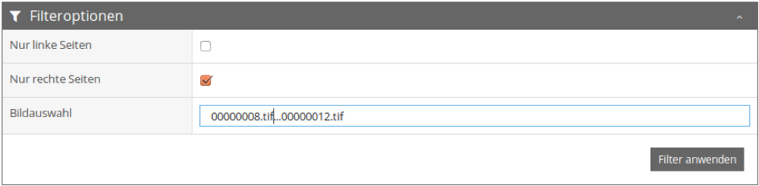

# Globale Zuschneideoptionen

Dieser Bereich ist nur verfügbar, wenn der Schritt `Seite zuschneiden` ausgewählt ist und diese Option in der Konfiguration aktiviert ist. Er zeigt die Position und Größe des Zuschneiderahmens für das aktuelle Bildes an. Die Anzeige erfolgt in Millimetern oder einer anderen konfigurierbaren Maßeinheit. Die hier dargestellten Werte sind direkt editierbar und bleiben stets synchron mit dem Rahmen in der Bildanzeige.

Zusätzlich verfügt dieser Bereich über Buttons, um die Größe und Position des aktuellen Rahmens auf andere Bilder zu übertragen:

| Icon | Beschreibung |
| :--- | :--- |
|   | Rahmen auf alle anderen Bilder übertragen. |
|   | Rahmen auf alle nachfolgenden Bilder übertragen. |
|   | Rahmen auf alle rechten Bilder übertragen. Dies ist nur verfügbar, wenn das aktuelle Bild ein rechtes ist. |
|   | Rahmen auf alle nachfolgenden rechten Bilder übertragen. Dies ist nur verfügbar, wenn das aktuelle Bild ein rechtes ist. |
|   | Rahmen auf alle linken Bilder übertragen. Dies ist nur verfügbar, wenn das aktuelle Bild ein linkes ist. |
|   | Rahmen auf alle nachfolgenden linken Bilder übertragen. Dies ist nur verfügbar, wenn das aktuelle Bild ein linkes ist. |

