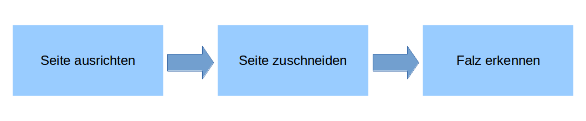

# Funktionsweise der Bildanalyse

Die Bildanalyse im LayoutWizzard unterteilt sich in drei separate Schritte:

## 1. Seite ausrichten

Erkennung der Ausrichtung der Seite und deren Rotation gegenüber der waagerechten. Diese Rotation wird beim Speichern herausgerechnet, so dass die Seite idealerweise waagerecht ausgerichtet ist. Auch als Deskewing bezeichnet.

## 2. Seite zuschneiden

Die Erkennung des erfassten Objektes, üblicherweise eines Buches. Um dieses Objekt wird ein rechteckiger Zuschneiderahmen ermittelt, der gerade eben das komplette Objekt enthält. Damit dieser Rahmen möglichst genau auf ein rechteckiges Objekt wie ein Buch passt, sollte die Rotation vorher angewandt werden. Dieser Vorgang wird auch als Ränder abschneiden bezeichnet, da die dunklen Bildränder dabei entfernt werden.

## 3. Falz erkennen

Bestimmung der Buchfalz. Nur notwendig, wenn tatsächlich die Buchfalz teil des Bildes ist und an ihr abgeschnitten werden soll um die gegenüberliegende Seite zu verbergen. Dieser Schritt ist hochgradig abhängig von der angenommenen Ausrichtung der Seite, also ob sie eine rechte oder linke Seite im Buch ist, oder eine Doppelseite. In letzterem Fall wird das Bild beim Speichern in zwei Einzelbilder unterteilt, je eines rechts und links der Falz.

