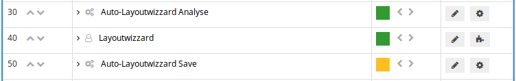

# Workflow

Der LayoutWizzard-Workflow in Goobi besteht in aller Regel aus mehreren Goobi-Workflow Schritten die zusammenarbeiten. Ein typischer LayoutWizzard Workflow als Teil eines Goobi-Workflows kann wie folgt aussehen:

Im ersten Schritt findet eine autmatische Layoutanalse der Bilder nach Rotation, Inhaltsbereich und Buchfalz statt. Dies geschieht üblicherweise in einem externen TaskManager um Systemresourcen in Goobi nicht zu belasten. Der zweite Schritt ist eine manuelle Überprüfung und Korrektur der Ergebnisse der automatischen Analyse. Dies geschieht in einem eigenen Goobi-Plugin. Sobald dies abgeschlossen ist, erfolgt die automatische Speicherung der zugeschnittenen Derivate aufgrund der in den ersten beiden Schritten gesammelten Daten. Dies geschieht erneut im TaskManager.

Alle globalen Einstellungen werden über die LayoutWizzard-Konfigurationsdatei gehandhabt, die im Kapitel `Konfiguration` beschrieben ist.

## Datenhaltung

Da die einzelnen Workflow-Schritte des LayoutWizzards auf einem gemeinsamen Datenbestand an Konfigurations- und Analysedaten arbeiten, müssen die Daten zumindest für die Dauer des LayoutWizzard Workflows persistent vorgehalten werden. Dies geschieht in der Dati `imageData.xml` im Goobi-Vorgangsordner, z.B. `/opt/digiverso/goobi/metadata/1234/imageData.xml`.

Diese Datei enthält sämtliche Konfigurationseinstellungen für den entsprechenden Vorgang und Analysedaten zu jedem Bild, aus denen im abschließenden Speicherschritt die Derivatbilder erstellt werden.

