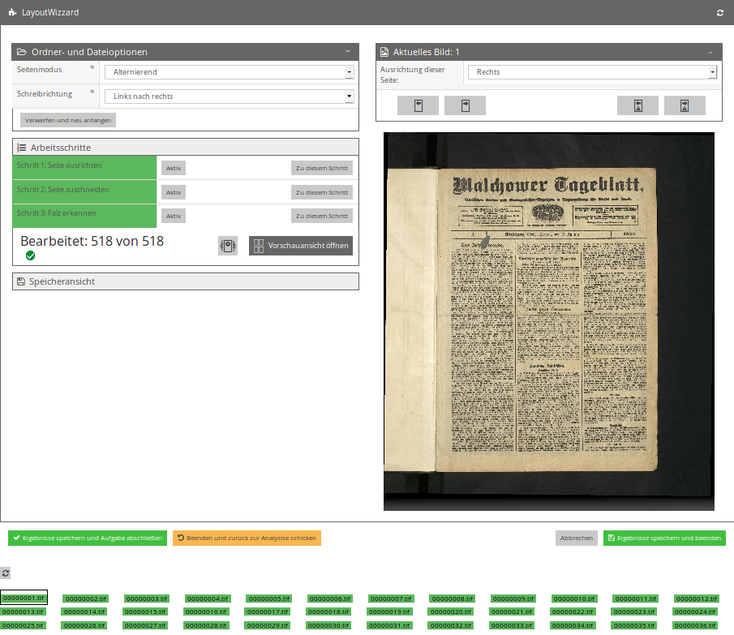

# Einzelseitenansicht

Diese Ansicht, bisweilen auch als `Übersichtsseite` bezeichnet, enthält globale Einstellungen des LayoutWizzards sowie alle Einstellungen zur aktuell betrachteten Seite. Die Ansicht gliedert sich in mehrere Teilbereiche. Die Details einiger dieser Bereiche sind nur sichtbar, wenn sie aktiv sind, was man durch drücken auf die Titelleiste des Bereichs erreicht. Die Titelleiste enthält außerdem bei manchen Bereichen rechts einen Knopf um den erweiterten Modus für diesen Bereich an- und auszuschalten. Im erweiterten Modus sind jeweils zusätzliche Optionen verfügbar die im normalen Betrieb nicht benötigt werden. Die Teilbereiche sind im Folgenden einzeln beschrieben.

