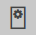
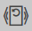
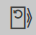

# Ausgewählter Analyseschritt

Dieser Bereich ist nur sichtbar wenn ein Analyseschritt ausgewählt wirde und ist dann benannt nach dem jeweiligen Schritt.Er enthält für jeden Schritt Konfigurationsparameter, die die automatische Analyse dieses Schrittes für alle Bilder bestimmen. Die wichtigesten Parameter sind direkt sichtbar, alle weiterem nur in der erweiterten Ansicht. Hilfestellungen zur Bedeutung jedes Parameters werden beim Druck auf `Hilfetexte einblenden` in der Goobi-Kopfleiste angezeigt.

Unterhalb der Parameter verfügt dieser Bereich noch über drei Knöpfe, die die Ausführung der Analyse regeln:

| Icon | Beschreibung |
| :--- | :--- |
|   | Analysiert das aktuelle Bild für den ausgewählten Analyseschritt, unabhängig vom Status des Analyseschrittes. Wenn vorhergehende Analyseschritte noch nicht ausgefährt wurden, werden diese Schritte ebenfalls ausgeführt. |
|   | Setzt den Analysestatus aller Bilder für den ausgewählten Analyseschritt zurück. Der Schritt und alle folgenden gelten für alle Bilder dann als nicht ausgeführt. Bereits existierende Analyseergebnisse werden verworfen. Dies ist wichtig, wenn man eine automatische Analyse erneut durchführen möchte, da Analyseschritte die als bereits ausgeführt gelten nicht erneut durchgeführt werden. |
|   | Setzt den Analysestatus für das aktuelle und alle folgenden Bilder zurück. |

