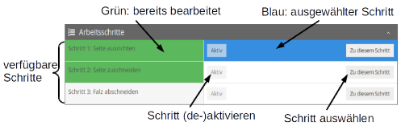

# Allgemeine Einstellungen

Unterhalb des Bildbereichs liegen mehrere Buttons, um das Plugin zu verlassen und den Workflow fortzusetzen.

| Icon | Beschreibung |
| :--- | :--- |
|   | Dieser Button speichert alle in der Oberfläche vorgenommenen Konfigurationen und Bilddaten für den aktuellen Vorgang und schließt das Plugin. Der Benutzer gelangt anschließend wieder zu der Ansicht, aus der er das Plugin betreten hat. |
|   | Dieser Button speichert alle in der Oberfläche vorgenommenen Konfigurationen und Bilddaten für den aktuellen Vorgang und schließt das Plugin sowie den aktuellen Goobi-Workflow Schritt. Der Benutzer gelangt anschließend zur `Meine Aufgaben` Ansicht. Ist der folgende Workflowschritt ein automatischer, wird dieser sofort gestartet. |
|   | Dieser Button speichert alle in der Oberfläche vorgenommenen Konfigurationen und Bilddaten für den aktuellen Vorgang und schließt das Plugin.  Der Benutzer gelangt anschließend zur `Meine Aufgaben` Ansicht. Der Goobi-Workflow wird um einen Schritt zurückgedreht, also in aller Regel zum vorhergehenden LayoutWizzard-Analyse Schritt. Ist dies ein automatischer Schritt, wird er sofort ausgeführt. |
|   | Dieser Button beendet das Plugin sofort ohne zuvor Daten zu speichern, außer über die Speicheransicht gespeicherter Bildderivate oder ein Zurücksetzen des gesamten Analyse. Der Benutzer gelangt anschließend wieder zu der Ansicht aus der er das Plugin betreten hat. |

