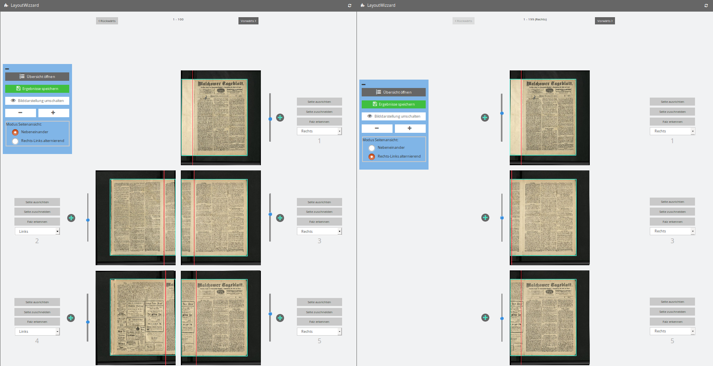

# Vorschauansicht

Die Vorschauansicht enthält eine Liste aller Bilder im Eingabeordner, in der Regel verteilt auf mehrere Seiten um Ladezeiten zu begrenzen. Je nach Einstellung werden gegenüberliegende rechte und linke Bilder nebeneinander angezeigt, oder es werden auf jeder Seite abwechelnd nur rechte und linke Bilder angezeigt um sie schneller vergleichen zu können.  
Diese beiden Modi der Vorschauansicht für rechts-links alternierende Seiten. Links mit gegenüberliegenden Seiten nebeneinander, rechts nur die rechten Seiten. Die zugehörigen linken Seiten werden mit Druck auf Vorwärts angezeigt.

Jede Bildanzeige in der Liste lässt sich direkt in dieser Ansicht bearbeiten, oder für jeden Analyseschritt in der Einzelseitenansicht öffnen. Außerdem enthält die Ansicht am linken Rand ein Menü mit Anzeige- und Navigationsoptionen.  
Über die Knöpfe `Vorwärts` und `Rückwärts` ober- und unterhalb der Liste kann man durch die Seiten blättern.

