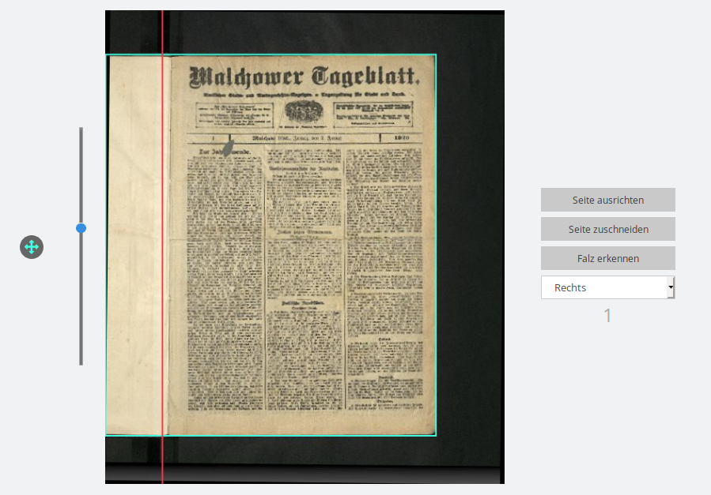
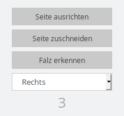

# Bildbereich

Die Vorschauansicht beinhaltet für jede Bilddatei den Abb. 1 abgebildeten Bildbereich. Er besteht aus der  eigentlichen Bildanzeige, dem Schritte-Navigationsmenü und Steuerelementen für Rahmenposition und Rotation.

## Bildanzeige

Die Bildanzeige enthält das eigentliche Bild. Das Bild ist den Analyseergebnissen entsprechend rotiert und enthält Marker für die Falzposition \(rot\) und den Zuschneiderahmen \(türkis\). Beide Marker können mit der Maus angefasst und bewegt werden um damit die Analysedaten zu korrigieren. Halten und Ziehen mit der Maus innerhalb des Zuschneiderahmens bewegt den gesamten Rahmen. Hält man bei einer dieser Aktionen die SHIFT Taste gedrückt, wird die Änderung auf alle folgenden Bilder der selben Ausrichtung auf der aktuellen Seite übertragen. Dabei werden relative Koordinaten verwendet. Verschiebt man also bei gedrückter SHIFT Taste die Falz eines rechten Bildes auf eine Position 10% vom linken Bildrand entfernt, wird für alle folgenden rechten Bilder auf der Seite die Falz ebenfalls 10% vom linken Bildrand positioniert; unabhängig von der absoluten Größe der Bilder. Zusätzlich gelangt man durch einen Doppelklick auf das Bild in einen Rotationsmodus, in dem man durch auf- und Abwärtsbewegungen der Maus die Bildrotation verändern kann. Diese Rotation ist nicht proportional zur Mausbewegung sondern umso stärker je weiter man die Maus vom Ursprung fortbewegt hat. Ein erneuter Doppelklick beendet den Rotationsmodus wieder.

## Steuerelement für die Rotation

Mit dem Schieberegler neben der Bildanzeige kann die Rotation des Bildes verändert werden.

## Steuerelement zum Verschieben

Regler-Knopf zum Verschieben des Zuschneiderahmens. Der Knopf kann in alle Richtungen mit der Maus bewegt werden und verschiebt damit die Rahmenposition. Die Rahmenverschiebung ist nicht proportional, je stärker der Knopf ausgelenkt wird, desto schneller wird der Rahmen verschoben.

## Navigationsmenü

Die drei Knöpfe oben öffnen das jeweilige Bild im jeweiligen Schritt in der Einzelseitenansicht. Ein erneuter Druck auf `Vorschauansicht öffnen` führt wieder zum selben Bild in der Vorschauansicht. 

Mit dem DropDown Menü darunter kann man die Ausrichtung der jeweiligen Seite ändern. Diese Änderung gilt immer nur für dieses eine Bild und hat keine Auswirkungen auf die folgenden Bilder.

Darunter findet sich noch die Bildnummer innerhalb des Eingabeordners.

