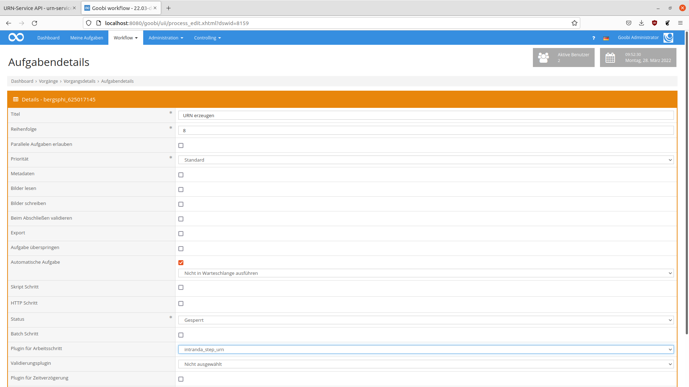

# Erzeugung von Uniform Resource Names


## Einführung
Die vorliegende Dokumentation beschreibt die Installation, die Konfiguration und den Einsatz des Step Plugins für die Generierung von Uniform Resource Names in Goobi workflow.

| Details |  |
| :--- | :--- |
| Identifier | intranda_step_urn |
| Source code | [https://gitea.intranda.com/goobi-workflow/goobi-plugin-step-urn](https://gitea.intranda.com/goobi-workflow/goobi-plugin-step-urn) |
| Lizenz | GPL 2.0 oder neuer |
| Kompatibilität | Goobi workflow 2022.03 |
| Dokumentationsdatum | 25.03.2022 |


## Arbeitsweise des Plugins
Das Plugin wird üblicherweise vollautomatisch innerhalb des Workflows ausgeführt. Es ermittelt zunächst, ob bereits ein Uniform Resource Name (URN) vorhanden ist. Sollte noch kein URN vorhanden sein, wird ein neuer URN registriert. Falls schon ein URN in den Metadaten vorhanden ist, wird versucht die Metadaten des URNs zu aktualisieren.


## Bedienung des Plugins
Dieses Plugin wird in den Workflow so integriert, dass es automatisch ausgeführt wird. Eine manuelle Interaktion mit dem Plugin ist nicht notwendig. Zur Verwendung innerhalb eines Arbeitsschrittes des Workflows sollte es wie im nachfolgenden Screenshot konfiguriert werden.




## Installation
Das Plugin besteht aus der folgenden Datei:

```text
plugin_intranda_step_urn.jar
```

Diese Datei muss in dem richtigen Verzeichnis installiert werden, so dass diese nach der Installation an folgendem Pfad vorliegt:

```bash
/opt/digiverso/goobi/plugins/step/plugin_intranda_step_urn.jar
```

Daneben gibt es eine Konfigurationsdatei, die an folgender Stelle liegen muss:

```bash
/opt/digiverso/goobi/config/plugin_intranda_step_urn.xml
```


## Konfiguration
Die Konfiguration des Plugins erfolgt über die Konfigurationsdatei `plugin_intranda_step_urn.xml` und kann im laufenden Betrieb angepasst werden. Im folgenden ist eine beispielhafte Konfigurationsdatei aufgeführt:

```markup
<?xml version="1.0" encoding="UTF-8"?>
<config_plugin>
    <!--
        order of configuration is:
          1.) project name and step name matches
          2.) step name matches and project is *
          3.) project name matches and step name is *
          4.) project name and step name are *
	-->

    <config>
        <!-- which projects to use for (can be more then one, otherwise use *) -->
        <project>*</project>
        <step>*</step>

    <!-- URI of the URN API, must use httos -->
		<uri>https://api.nbn-resolving.org/v2/</uri>

		<!-- namespace in which new URNs shall be created -->
		<namespace>urn:nbn:de:gbv:XX</namespace>

		<!-- name of the API user -->
		<apiUser>UserName</apiUser>

		<!-- password of the API user -->
		<apiPassword>Password</apiPassword>

		<!--target url URN will forward to -->
		<publicationUrl>https://viewer.example.org/{meta.CatalogIDDigital}</publicationUrl>

		<!--metadataType in METS-File -->
        <metadataType>URN</metadataType>
    </config>
</config_plugin>
```

| Parameter | Erläuterung |
| :--- | :--- |
| `project` | Dieser Parameter legt fest, für welches Projekt der aktuelle Block `<config>` gelten soll. Verwendet wird hierbei der Name des Projektes. Dieser Parameter kann mehrfach pro `<config>` Block vorkommen. |
| `step` | Dieser Parameter steuert, für welche Arbeitsschritte der Block `<config>` gelten soll. Verwendet wird hier der Name des Arbeitsschritts. Dieser Parameter kann mehrfach pro `<config>` Block vorkommen. |
| `uri` | In diesem Parameter muss die URL der API hinterlegt werden. In der Regel kann der Standardeintrag `https://api.nbn-resolving.org/v2/` übernommen werden.  |
| `namespace` | Der Namensraum in dem die neuen URNs angelegt werden. |
| `apiUser` | Der Name des API-Nutzers. |
| `apiPassword` | Das Passwort des API-Nutzers. |
| `publicationUrl`   | Die URL unter der Sie das digitalisierte Werk in Zukunft zur Verfügung stellen. In der Regel wird die Veröffentlichungs-URL einem Muster folgen, z.B. `https://viewer.example.org/{meta.CatalogIDDigital}`. In diesem Fall wird davon ausgegangen, dass die Werke in Zukunft unter einer URL veröffentlicht werden, die das Metadatum `Identifier` enthält. |
| `metadataType`  | Gibt den Metadatentyp an, unter dem der URN erfasst werden soll. Hier sollte die Vorgabe nicht verändert werden.  |
