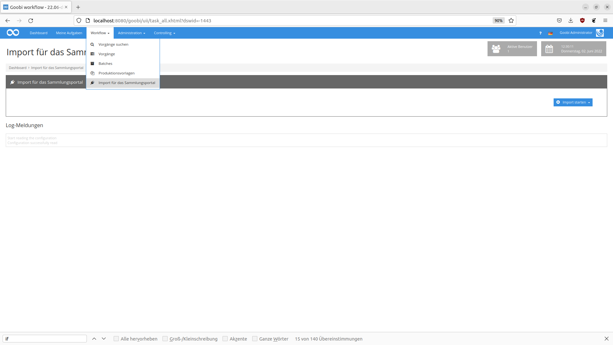

# Import-Plugin für die HU Berlin

## Einführung

Dieses Workflow Plugin soll den Massenimport von Daten erlauben. In der Regel kommen bei einem Import mindestens 2 Exceldateietypen zum Einsatz. Typ 1 spezifiziert i.d.R. Metadaten des TopStruct (TitleDocMain oder andere Metadatentypen, die das jeweilige Goobi Ruleset vorsieht) und Eigenschaften des Vorgangs (Dateiname, zukünftiger Name des Vorgangs usw.).  Typ 2 spezifiziert in der Regel Metadaten, die Unterelemente eines Vorgangs beschreiben. (Kapitel/Lochkarte,Name einer Mediendatei).

## Übersicht

| Details |  |
| :--- | :--- |
| Identifier | intranda\_workflow\_hu\_importer |
| Source code | [https://github.com/intranda/goobi-plugin-workflow-hu-importer](https://github.com/intranda/goobi-plugin-workflow-hu-importer) |
| Lizenz | GPL 2.0 oder neuer |
| Kompatibilität | Goobi workflow 22.05 |
| Dokumentationsdatum | 01.06.2022 |

## Installation

Das Plugin besteht aus folgenden Dateien:

```text
plugin_intranda_workflow_hu_importer.jar
plugin_intranda_workflow_hu_importer-GUI.jar
```

Die Datei `plugin_intranda_workflow_hu_importer.jar` muss in folgendes Verzeichnis kopiert werden:

```bash
/opt/digiverso/goobi/plugins/workflow/
```
Die Datei `plugin_intranda_workflow_hu_importer-GUI.jar` muss in folgendes Verzeichnis kopiert werden:
```bash
/opt/digiverso/goobi/plugins/GUI
```

Daneben gibt es die Konfigurationsdatei `plugin_intranda_workflow_hu_importer.xml` , die in folgendem Ordner abgelegt werden muss:

```bash
/opt/digiverso/goobi/config/
```

## Konfiguration
Die Konfiguration des Plugins erfolgt über die Konfigurationsdatei `plugin_intranda_workflow_hu_importer.xml` und kann im laufenden Betrieb angepasst werden. Im folgenden ist eine beispielhafte Konfigurationsdatei aufgeführt:

```xml
<config_plugin>

	<!--import set for excel files
	Attributes in [] are optional
		name: name of the import set, which will be displayed in the dropdonwnmenu
		metadataFolder: where are the documents located
		[mediaFolder]: where are the media files located
		workflow: the workflow that shall be used
		[project]: the goobi project that shall be used
		mappingSet: the mapping that shall be used by the import set
		publicationType: the publicationType that shall be used i.e. Monograph,...
		structureType: structureType the metadata will be mapped to
		[importSetDescription]: Path to xls-file with description of importset-files
		[descriptionMappingSet]: Mapping for the importsetdescription file
		[eadType]: Type of the EAD-entry
		[eadFile]: Name of the EAD-file/database
		[eadNode]:"ID of the parent node that this Imporset will use"
		[rowStart]: first row that will be read
		[rowEnd]: last row that will be read
	  -->
  <importSet name="Lochkarten EAD"
		metadataFolder="/opt/digiverso/import/mdvos/"
		mediaFolder ="/opt/digiverso/import/mdvos/Lochkartei_Testdaten"
		workflow="Sample_Workflow"
		project="Archive_Project"
		mappingSet="Lochkarten"
		publicationType="Trenner"
		structureType="Lochkarte"
		importSetDescription="/opt/digiverso/import/description/description.xlsx"
		descriptionMappingSet="Description"
		eadType="file"
		eadFile="EAD-Store - Sudanarchäologie.xml"
		eadNode="f91585c7-9cd4-47f1-b9e4-5f26a6744fe3"
		/>

  <importSet name="Lochkarten"
		metadataFolder="/opt/digiverso/import/mdvos/"
		mediaFolder ="/opt/digiverso/import/mdvos/Lochkartei_Testdaten"
		workflow="Sample_Workflow"
		project="Archive_Project"
		mappingSet="Lochkarten"
		publicationType="Trenner"
		structureType="Lochkarte"
		importSetDescription="/opt/digiverso/import/description/description.xlsx"
		descriptionMappingSet="Description"
		/>

	<importSet name="LochkartenOhneDescription"
		metadataFolder="/opt/digiverso/import/mdvos/"
		mediaFolder ="/opt/digiverso/import/mdvos/Lochkartei_Testdaten"
		workflow="Sample_Workflow"
		project="Archive_Project"
		mappingSet="Lochkarten"
		publicationType="Trenner"
		structureType="Lochkarte"
		useFileNameAsProcessTitle="true"
		/>
	<!-- mapping set -> set of fields that describe a mapping
		name = name of the MappingSet

		field - mapping for a row of an excel file
		Attributes in [] are optional
		column: column of the xls-file that will be mapped
        [label]; column header
        [mets] mets of metadata element
        type: person, metadata, media   //maybe add eadonly
        [separator]: default value is ;
        [blankBeforeSeparator]: default value is false
        [blankAfterSeparator]: default value is false
        [ead] name of the ead metadata type
	-->
	<mappingSet name="Lochkarten">
		<field column="D" label="Inventar-Nr./Signatur" type="metadata" mets="shelfmarksource"/>
		<field column="E" label="Institutionsnachweis/ Sammlung" type="metadata" mets="PhysicalLocation"/>
		<field column="F" label="Titel" type="metadata" mets="TitleDocMain"/>
		<field column="G" label="Schlagwort" type="metadata" mets="Subject"/> <!--mets="Subject"-->
		<field column="H" label="Schlagwort" type="metadata" mets="Subject"/>
		<field column="I" label="Material" type="metadata" mets="FormatSourcePrint"/>
		<field column="J" label="Maße" type="metadata" mets="SizeSourcePrint"/>
		<field column="K" label="Trenner" type="metadata" mets="OtherTitle"/>
		<field column="L" label="Geokoordinaten" type="metadata" mets=""/>


		<field column="M,N" label="Datei recto" type="metadata" mets="IdentifierRelatedWork"/>
		<field column="M,N" label="Datei recto" type="media" mets="IdentifierRelatedWork"/>
	</mappingSet>

	<mappingSet name="Description">
		<field column="A" label="Dateiname" type="FileName" />
		<field column="B" label="Titel" type="metadata" mets="TitleDocMain"  ead="unittitle"/>
		<field column="D" label="Prozessname" type="ProcessName"/>
		<field column="E" label="Date" type="metadata" ead="unitdate" />
	</mappingSet>
</config_plugin>
```

Das Plugin kennt 4 Elementtypen.

| Element | Beschreibung |
| :--- | :--- |
| `config_plugin`  | `config_plugin` ist das Hauptelement der Konfigurationsdatei und enthält alle anderen Elemente  |
| `importSet`  | Ein ImportSet beschreibt gleichartige Importvorgänge.   |
| `mappingSet`  |  Ein MappingSet besteht aus einer Menge von field-Elementen.|
| `field`  | `field`-Elemente sind Kindelemente von MappingSet. Jedes Element ordnet einer Spalte des Exceldokumentes eine Eigenschaft, des zukünftiges Vorgangs oder Strukturlements zu.  |

### Das Element importSet

| Attribut | Beschreibung |
| :--- | :--- |
| `name` | Name des ImportSets. Dieser wird später im GUI angezeigt. |
|`metadataFolder`| Hier muss angegeben werden, wo sich der Ordner mit den Dateien befindet, die mit dem im Attribut `mappingSet` spzifizierten MappingSet gemappt werden.|
|`mediaFolder`| Dieses `optionale` Attribut gibt an, wo sich die Mediendateien befinden. |
|`workflow`| Hier muss angegeben werden, welche Produktionsvorlage verwendet werden soll |
|`project`| Hier kann angegeben werden, welchem Projekt der Vorgang zugeordnet werden soll. Das Attribut ist `optional`. Wird kein Projekt angegeben, wird das in der Produktionsvorlage spezifizierte Projekt verwendet. |
|`mappingSet`| Hier muss angegeben werden, mit welchen Mapping die Datei im `metadataFolder` verarbeitet werden sollen.|
|`publicationType`| Der Publikationstyp des Vorgangs z.B.. Monographie,...|
|`structureType`|Der Strukturtyp der Elemente die im Vorgang angelegt werden sollen. Kapitel oder Lochkarten z.B. Jede Zeile eines Exceldokumentes des Typs 1 beschreibt dabei ein Element dieses Strukturtyps|
|`importSetDescription`| Dieses `optionale` Attribut gibt an, wo sich die Datei mit Metadaten zu den Vorgängen befindet . Ist der Parameter gesetzt, muss zu jeder Datei im `metadataFolder` eine Zeile in diesem Dokument spezifiziert sein.|
|`descriptionMappingSet`| Hier kann das MappingSet für die Datei mit der ImporSet-Beschreibung spezifiziert werden (. Das Attribut ist `optional`.|
|`eadType`| Typ des Ead-Eintrages (z.B. file). Das Attribut ist `optional`.|
|`eadFile`| Name der EAD-Datei/Datenbank. Das Attribut ist `optional`.|
|`eadNode`| ID des Vaterknotens unter dem der neue EAD-Knoten eingefügt werden soll. Das Attribut ist `optional`.|
|`rowStart`| Erste Zeile einer Datei im metadataFolder, die gelesen werden soll. Das Attribut ist `optional`.|
|`rowEnd`| Letzte Zeile des eines Dokumentes im metadataFolder, die gelesen werden soll. Das Attribut ist `optional`.|
|`useFileNameAsProcessTitle`|Wenn dieser optionale Parameter auf true gesetzt wird, wird der Dateiname|


### Die Elemente mappingSet und field
Ein Element des Typs `mappingSet` hat nur das Attribut `name`. Dieses Attribut ist wichtig, um einem ImportSet in der Rolle eines `mappingSet`s oder eines `descriptionMappingSet`s zugeordnet zu werden. Ein mappingSet kann beliebig viele Kindelemente des Typs field haben.
Das Element field hat folgende Attribute.


| Attribut | Beschreibung |
| :--- | :--- |
|`column`| Spalte(n) die gemappt werden soll(en). Der eingelesene Werte wird dann einem METS-Metadatentyp, der im Attribut mets definiert wird, zugeordnet. Alternativ kann der Inhalt der Zelle auch einer Vorgangseigenschaft wie dem Vorgangstitel zugeordnet werden, wenn als type ProcessName spezifiziert wird. Wenn mehrere Spalten in einen Wert abgebildet werden sollen, kann man die Spaltenindexe als Komma separierte Liste übergeben (z.B. "A,B,AA") Das Attribut ist `obligatorisch`. |
|`label`| Hier kann `optional` der Spaltentitel angegeben werden.|
|`mets`| Bestimmt welchem METS-Typ der eingelesene Wert zugeordnet wird. Zulässig sind hier alle Werte, die laut Regelsatz ein gültiges Metadatum des entsprechenden Elements sind.|
|`type`| Dieser Parameter ist `obligatorisch` und kann die Werte: person, metadata, media, FileName, ProcessName  annehmen. Die Werte werden kurz unter der Tabelle erläutert.|
|`separator`| Dieser Separator wird verwendet, wenn mehrere Elemente in einen Wert abgebildet werden sollen. Der Standardwert ist `;`.  Das Attribut ist `optional`.|
|`blankBeforeSeparator`| Falls der Inhalt mehrerer Spalten in einen Wert gemappt werden soll, kann hier bestimmt werden, ob ein Leerzeichen vor dem Separator gesetzt werden soll. Der Standardwert ist `false`. Das Attribut ist `optional`.|
|`blankAfterSeparator`|Falls der Inhalt mehrerer Spalten in einen Wert abgebildet werden soll, kann hier bestimmt werden, ob ein Leerzeichen nach dem Separator gesetzt werden soll. Der Standardwert ist `false`.  Das Attribut ist `optional`.|
|`ead`| Wenn dieser `optionale` Parameter gesetzt ist, wird der Inhalt der Zelle diesem METS-Metadatentyp zugeordnet.Das Attribut ist `optional`.|


## Benutzung des Plugins

Nach der Installation und Inbetriebnahme des Plugins steht dieses innerhalb des Menüs `Workflow` zur Verfügung. Nach dem Aufruf kann ein ImportSet ausgewählt werden und der Datenimport gestartet werden. Das Plugin wird versuchen im `metadataFolder` die Ordner `processed`und `failure` anzulegen. Es sollte also darauf geachtet werden, dass Goobi in diesem Ordner Schreibrechte hat. Wird eine Datei ohne Fehler eingelesen, wird Sie in den Ordner processed verschoben. Falls ein Fehler auftritt, landet sie im Ordner failure. Die im `mediaFolder` liegenden Dateien werden lediglich kopiert.



