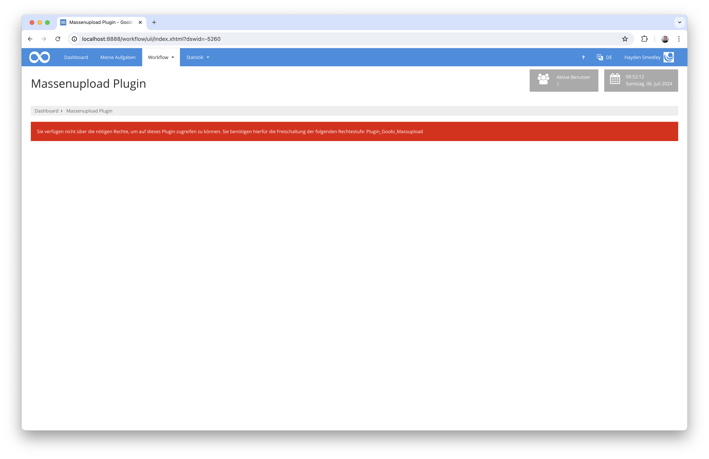
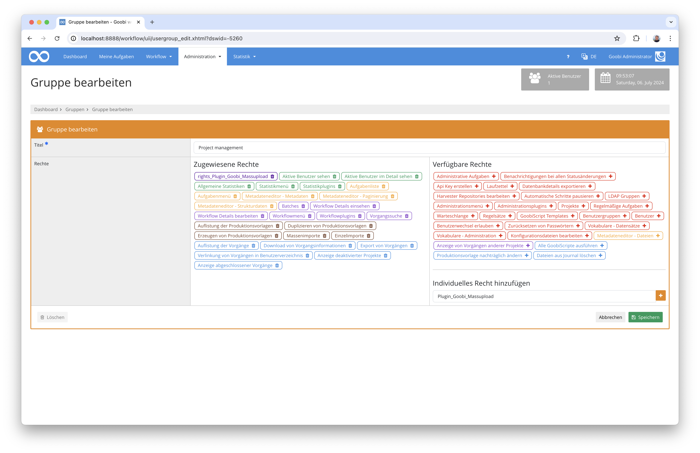
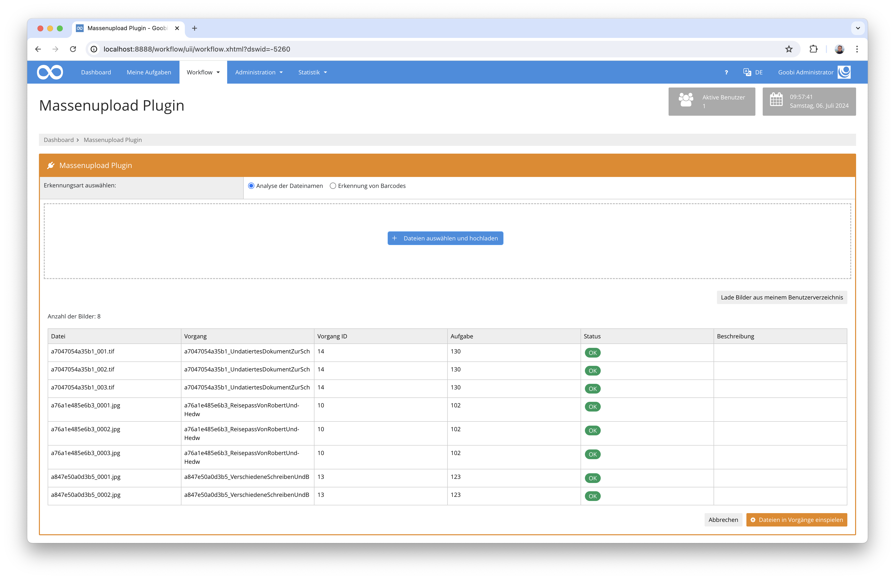

# Massenupload

## Einführung

Dieses Workflow-Plugin erlaubt einen Massenupload von Dateien, die von Goobi workflow automatisch zu den richtigen Vorgängen zugeordnet werden sollen. Hierfür stellt das Plugin eine eigene Oberfläche zur Verfügung, die entweder einen Upload direkt über die Weboberfläche erlaubt oder alternativ ebenso Bilder aus dem Nutzerverzeichnis auslesen kann. Diese Bilder werden durch das Plugin auf ihren Namen geprüft, um daraus den zugehörigen Goobi-Vorgang zu ermitteln. Ist eine Ermittlung des Vorgangs eindeutig und befindet sich der ermittelte Goobi-Vorgang auch im konfigurierten Arbeitsschritt des Workflows, so werden die Bilder diesem zugeordnet und der Workflow weiter verarbeitet.

Neben der Zuordnung der Dateien auf Basis des Dateinamens ist ebenso konfigurierbar, dass stattdessen eine Bildanalyse erfolgen soll, die Barcodes liest. Damit ist es möglich, dass Bilder mehrere Vorgänge beispielsweise fortlaufend benannt sind und lediglich ein Trennblatt zwischen den Aufnahmen mit aufgenommen werden muss. Alle Bilder nach einem solchen Trennblatt mit identifizierbarem Barcode werden dem jeweiligen Vorgang zugewiesen, bis der nächste Barcode im Dateistapel ermittelt wird.

## Übersicht

| Details |  |
| :--- | :--- |
| Identifier | intranda\_workflow\_massupload |
| Source code | [https://github.com/intranda/goobi-plugin-workflow-massupload](https://github.com/intranda/goobi-plugin-workflow-massupload) |
| Lizenz | GPL 2.0 oder neuer |
| Kompatibilität | Goobi workflow 20.06 |
| Dokumentationsdatum | 20.09.2020 |

## Installation

Zur Installation des Plugins müssen folgende beiden Dateien installiert werden:

```bash
/opt/digiverso/goobi/plugins/workflow/plugin_intranda_workflow_massupload.jar
/opt/digiverso/goobi/plugins/GUI/plugin_intranda_workflow_massupload-GUI.jar
```

Um zu konfigurieren, wie sich das Plugin verhalten soll, können verschiedene Werte in der Konfigurationsdatei angepasst werden. Die Konfigurationsdatei befindet sich üblicherweise hier:

```bash
/opt/digiverso/goobi/config/plugin_intranda_workflow_massupload.xml
```

Der Inhalt dieser Konfigurationsdatei sieht wie folgt aus:

```markup
<config_plugin>

    <!-- which file types shall be allowed for uploading these -->
    <allowed-file-extensions>/(\.|\/)(gif|jpe?g|png|tiff?|jp2|pdf)$/</allowed-file-extensions>

    <!-- name of the folder inside of a users home directory to use as alternative for web upload -->
    <user-folder-name>mass_upload</user-folder-name>

    <!-- define if instead of the file naming a barcode shall be analyzed to match the following images to the corresponding process until the next barcode
        gets recognized -->
    <use-barcodes>true</use-barcodes>

    <!-- copy images using goobi script in the background (true or false) -->
    <copy-images-using-goobiscript>false</copy-images-using-goobiscript>

    <!-- which workflow step has to be open to allow the upload into the process -->
    <allowed-step>Scanning</allowed-step>
    <allowed-step>Upload</allowed-step>

    <!-- which part of the files shall be used to find the right process (prefix, suffix or complete) -->
    <filename-part>prefix</filename-part>
    <filename-separator>_</filename-separator>

</config_plugin>
```

Für eine Nutzung dieses Plugins muss der Nutzer über die korrekte Rollenberechtigung verfügen.



Bitte weisen Sie daher der Gruppe die Rolle `Plugin_Goobi_Massupload` zu.



## Erläuterung der Konfigurationsoptionen

Die Konfiguration des Plugins gestaltet sich wie folgt:

| Wert | Beschreibung |
| :--- | :--- |
| `allowed-file-extensions` | Mit diesem Parameter wird festgelegt, welche Datein hochgeladen werden dürfen. Hierbei handelt es sich um einen regulären Ausdruck. |
| `user-folder-name` | Wenn die Dateien aus dem Nutzerverzeichnis ausgelesen werden sollen, kann hier festgelegt werden, wie der Ornder innerhalb des Nutzerverzeichnisses heisst, aus dem die Dateien gelesen werden sollen. |
| `use-barcodes` | Mit diesem Parameter wird festgelegt, ob die Zuordnung zu den Vorgängen auf Basis von Barcodes erfolgen soll oder ob diese anhand der Dateibenennungen erfolgen soll. |
| `copy-images-using-goobiscript` | Sofern der Datentransfer im Hintergrund über die Warteschlangenfunktionalität von GoobiScript erfolgen soll, kann dies hier festgelegt werden. |
| `allowed-step` | Legen Sie in diesem wiederholbaren Parameter fest, welcher Arbeitsschritt im ermittelten Vorgang sich gerade im Status `offen` befinden muss. |
| `filename-part` | Mit diesem Parameter kann festgelegt werden, wie die Zuordnung der Dateinamen zu den Vorgängen erfolgen soll. |
| `filename-separator` | Geben Sie hier dasjenige Trennzeichen an, anhand dessen ein Prefix oder Suffix abgeschnitten werden soll. Somit kann festgelegt werden, dass z.B. aus einer Datei `"`kleiuniv_987654321\_00002.tif`bei einer Zuordnung mittels`prefix`und dem Trennzeichen`_`ein Vorgang ermittelt werden soll, der`kleinuniv\_987654321\` heisst. |

## Bedienung des Plugins

Wenn das Plugin korrekt installiert und konfiguriert wurde, ist es innerhalb des Menüpunkts `Workflow` zu finden.


An dieser Stellen können nun entweder Dateien hochgeladen oder aus dem Nutzerverzeichnis ausgelesen werden. Nach der Analyse der Dateinamen bzw. Bilder zeigt Goobi workflow an, welchen Vorgängen die eingespielten Bilder zugewiesen werden können.



Mit einem Klick auf den Button `Dateien in Vorgänge einspielen` werden die Bilder nun in die Verzeichnisse der ermittelten Vorgänge verschoben und der Workflow fortgeführt.

Bitte beachten Sie: Soll eine Erkennung von Barcodes erfolgen, um daraus die Vorgänge zu ermitteln, so ist wichtig, dass auch die Barcodes in ausreichender Größe und Qualität vorliegen, damit die Erkennung erfolgreich ist.


